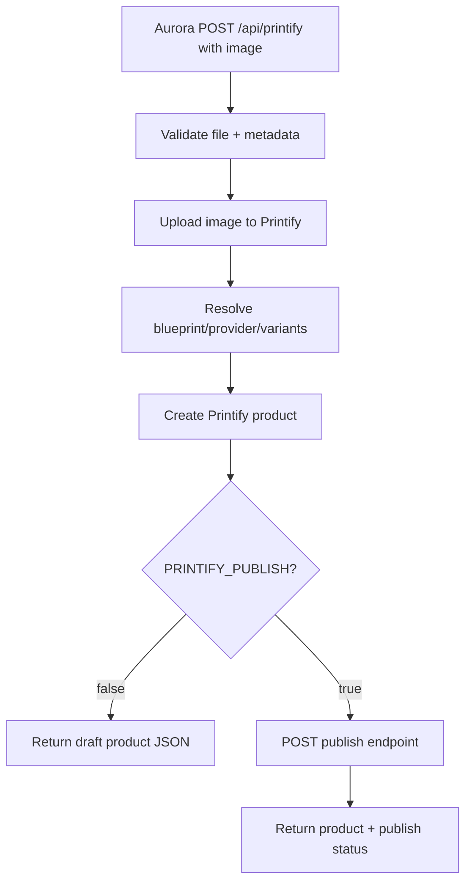

# Printify API Spec for Aurora Gildan 5000 Product Upload

Last verified: 2026-04-29

This document summarizes the Printify REST API pieces needed to replace the current Aurora Puppeteer/PrintifyPuppet flow with direct backend API calls for creating Gildan 5000 T-shirt products.

## Goal

Implement a backend-only Aurora flow:

1. Accept an uploaded artwork file from Aurora.
2. Upload the artwork to Printify Media Library.
3. Resolve the Gildan 5000 blueprint, print provider, and variant IDs.
4. Create a Printify product using the uploaded artwork.
5. Optionally publish/sync the product to a connected sales channel.
6. Return the Printify product ID, mockup/image data, and status to Aurora.

---

## Important Printify API Rules

### Base URL

```text
https://api.printify.com/v1
```

### Transport and format

All requests should use HTTPS. Printify expects UTF-8 JSON request/response bodies.

```http
Content-Type: application/json;charset=utf-8
Authorization: Bearer <PRINTIFY_API_TOKEN>
User-Agent: Aurora/1.0
```

### Backend-only requirement

Printify does **not** support CORS for frontend/browser requests. Aurora must call Printify from the Node backend, not from browser JavaScript.

### Rate limits

Printify currently documents:

| Limit | Value |
|---|---:|
| Global API rate limit | 600 requests/minute |
| Catalog endpoints | 100 requests/minute |
| Product publishing endpoint | 200 requests / 30 minutes |
| Error budget | Requests returning errors should not exceed 5% of total requests |

---

## Required Access Scopes

For the direct product creation flow, the Printify token should have at least:

| Scope | Needed for |
|---|---|
| `shops.read` | Read available shops / obtain `shop_id` |
| `catalog.read` | Read blueprints, providers, variants |
| `print_providers.read` | Read print provider data |
| `uploads.write` | Upload artwork to media library |
| `uploads.read` | Verify/read uploaded artwork |
| `products.write` | Create/update/publish products |
| `products.read` | Fetch created products |

For a single merchant account, use a Printify Personal Access Token. For a multi-merchant platform, use OAuth 2.0.

---

## Environment Variables for Aurora

```bash
# Required
PRINTIFY_API_TOKEN="..."
PRINTIFY_SHOP_ID="..."

# Strongly recommended after one catalog lookup
PRINTIFY_BLUEPRINT_ID="6"              # Gildan 5000 is shown in docs as id 6 in the catalog example
PRINTIFY_PRINT_PROVIDER_ID="..."       # Provider chosen for this blueprint
PRINTIFY_VARIANT_IDS="..."             # Comma-separated variant IDs to enable

# Product defaults
PRINTIFY_PRICE_CENTS="2499"
PRINTIFY_PUBLISH="false"

# Artwork placement defaults
PRINTIFY_PRINT_AREA_POSITION="front"
PRINTIFY_IMAGE_X="0.5"
PRINTIFY_IMAGE_Y="0.5"
PRINTIFY_IMAGE_SCALE="1"
PRINTIFY_IMAGE_ANGLE="0"

# Optional filtering if PRINTIFY_VARIANT_IDS is not set
PRINTIFY_COLORS="Black,White,Navy"
PRINTIFY_SIZES="S,M,L,XL,2XL"
```

---

## Flow Overview



---

# Endpoint Specs

## 1. List Shops

Use this to find `PRINTIFY_SHOP_ID`.

```http
GET /v1/shops.json
```

### Example cURL

```bash
curl -X GET "https://api.printify.com/v1/shops.json" \
  -H "Authorization: Bearer $PRINTIFY_API_TOKEN" \
  -H "User-Agent: Aurora/1.0"
```

### Example response shape

```json
[
  {
    "id": 5432,
    "title": "My new store",
    "sales_channel": "My Sales Channel"
  },
  {
    "id": 9876,
    "title": "My other new store",
    "sales_channel": "disconnected"
  }
]
```

### Notes

Use the returned `id` as `{shop_id}` in product and order endpoints.

---

## 2. List Blueprints

Use this to find the Gildan 5000 blueprint.

```http
GET /v1/catalog/blueprints.json
```

### Example cURL

```bash
curl -X GET "https://api.printify.com/v1/catalog/blueprints.json" \
  -H "Authorization: Bearer $PRINTIFY_API_TOKEN" \
  -H "User-Agent: Aurora/1.0"
```

### Gildan 5000 detection

The Printify docs show this catalog example:

```json
{
  "id": 6,
  "title": "Unisex Heavy Cotton Tee",
  "brand": "Gildan",
  "model": "5000"
}
```

Do not rely only on title. Match by:

```js
blueprint.brand === "Gildan" && blueprint.model === "5000"
```

Fallback title match:

```js
title.toLowerCase().includes("gildan") || title.toLowerCase().includes("heavy cotton")
```

---

## 3. List Print Providers for Blueprint

Use this after you know the blueprint ID.

```http
GET /v1/catalog/blueprints/{blueprint_id}/print_providers.json
```

### Example cURL

```bash
curl -X GET "https://api.printify.com/v1/catalog/blueprints/$PRINTIFY_BLUEPRINT_ID/print_providers.json" \
  -H "Authorization: Bearer $PRINTIFY_API_TOKEN" \
  -H "User-Agent: Aurora/1.0"
```

### Response shape

```json
[
  {
    "id": 3,
    "title": "The Dream Junction",
    "location": {
      "city": "Brooklyn",
      "country": "US",
      "region": "NY"
    }
  }
]
```

### Provider selection rules

Prefer an explicit `PRINTIFY_PRINT_PROVIDER_ID`.

If auto-selecting:

1. Prefer providers with required colors/sizes in stock.
2. Prefer providers in target geography.
3. Prefer providers with Printify Express eligibility if speed matters.
4. Cache the chosen provider per blueprint.

---

## 4. List Variants for Blueprint + Provider

Use this to find exact color/size IDs.

```http
GET /v1/catalog/blueprints/{blueprint_id}/print_providers/{print_provider_id}/variants.json
```

### Example cURL

```bash
curl -X GET "https://api.printify.com/v1/catalog/blueprints/$PRINTIFY_BLUEPRINT_ID/print_providers/$PRINTIFY_PRINT_PROVIDER_ID/variants.json?show-out-of-stock=1" \
  -H "Authorization: Bearer $PRINTIFY_API_TOKEN" \
  -H "User-Agent: Aurora/1.0"
```

### Response shape

```json
{
  "variants": [
    {
      "id": 17390,
      "title": "Heather Grey / XS",
      "options": {
        "color": "Heather Grey",
        "size": "XS"
      },
      "placeholders": [
        {
          "position": "front",
          "height": 3995,
          "width": 3153
        },
        {
          "position": "back",
          "height": 3995,
          "width": 3153
        }
      ]
    }
  ]
}
```

### Variant selection rules

Prefer explicit variant IDs:

```bash
PRINTIFY_VARIANT_IDS="12142,12143,12144"
```

If deriving from filters:

```js
const colors = ["Black", "White", "Navy"];
const sizes = ["S", "M", "L", "XL", "2XL"];
```

Select variants where:

```js
variant.options.color in colors
variant.options.size in sizes
```

Validate that every selected variant supports the requested placeholder position, usually `front`.

---

## 5. Upload Artwork Image

Use this to upload image files to the Printify Media Library.

```http
POST /v1/uploads/images.json
```

Printify supports either a public image URL or base64 file contents.

### Preferred for larger files: upload by URL

```json
{
  "file_name": "artwork.png",
  "url": "https://example.com/path/artwork.png"
}
```

### Base64 upload

```json
{
  "file_name": "artwork.png",
  "contents": "base-64-encoded-content"
}
```

### Example cURL, URL upload

```bash
curl -X POST "https://api.printify.com/v1/uploads/images.json" \
  -H "Authorization: Bearer $PRINTIFY_API_TOKEN" \
  -H "Content-Type: application/json;charset=utf-8" \
  -H "User-Agent: Aurora/1.0" \
  -d '{
    "file_name": "artwork.png",
    "url": "https://example.com/artwork.png"
  }'
```

### Example cURL, base64 upload

```bash
ARTWORK_B64="$(base64 -w 0 artwork.png)"

curl -X POST "https://api.printify.com/v1/uploads/images.json" \
  -H "Authorization: Bearer $PRINTIFY_API_TOKEN" \
  -H "Content-Type: application/json;charset=utf-8" \
  -H "User-Agent: Aurora/1.0" \
  -d "{
    \"file_name\": \"artwork.png\",
    \"contents\": \"$ARTWORK_B64\"
  }"
```

### Response shape

```json
{
  "id": "5e16d66791287a0006e522b2",
  "file_name": "artwork.png",
  "height": 5979,
  "width": 17045,
  "size": 1138575,
  "mime_type": "image/png",
  "preview_url": "https://example.com/image-storage/uuid",
  "upload_time": "2020-01-09 07:29:43"
}
```

### Notes

Save the returned `id`; it is the image ID used in product `print_areas`.

Printify recommends URL uploads for files larger than 5 MB. Base64 uploads larger than 5 MB may not be future-proof.

---

## 6. Create Product

Use this to create the Gildan 5000 product.

```http
POST /v1/shops/{shop_id}/products.json
```

### Required fields

| Field | Type | Notes |
|---|---|---|
| `title` | string | Product title |
| `description` | string | HTML/text description |
| `blueprint_id` | integer | Gildan 5000 blueprint ID |
| `print_provider_id` | integer | Provider ID for that blueprint |
| `variants` | array | Variant IDs, price, enabled flag |
| `print_areas` | array | Artwork placement mapped to variants |

### Minimal Gildan 5000 request body

```json
{
  "title": "ALSH.ai T-Shirt",
  "description": "Unisex Gildan 5000 heavy cotton tee with front print.",
  "blueprint_id": 6,
  "print_provider_id": 123,
  "variants": [
    {
      "id": 11111,
      "price": 2499,
      "is_enabled": true
    },
    {
      "id": 11112,
      "price": 2499,
      "is_enabled": true
    }
  ],
  "print_areas": [
    {
      "variant_ids": [11111, 11112],
      "placeholders": [
        {
          "position": "front",
          "images": [
            {
              "id": "5e16d66791287a0006e522b2",
              "x": 0.5,
              "y": 0.5,
              "scale": 1,
              "angle": 0
            }
          ]
        }
      ]
    }
  ],
  "tags": ["Gildan 5000", "T-Shirt", "ALSH.ai"]
}
```

### Example cURL

```bash
curl -X POST "https://api.printify.com/v1/shops/$PRINTIFY_SHOP_ID/products.json" \
  -H "Authorization: Bearer $PRINTIFY_API_TOKEN" \
  -H "Content-Type: application/json;charset=utf-8" \
  -H "User-Agent: Aurora/1.0" \
  -d @create-product.json
```

### Price format

`price` is in cents.

Examples:

| Display price | API price |
|---:|---:|
| `$19.99` | `1999` |
| `$24.99` | `2499` |
| `$29.99` | `2999` |

### Image placement fields

| Field | Type | Meaning |
|---|---|---|
| `id` | string | Uploaded image ID |
| `x` | number | Horizontal placement, usually `0.5` center |
| `y` | number | Vertical placement, usually `0.5` center |
| `scale` | number | Artwork scale |
| `angle` | number | Rotation degrees |

### Product creation response

The response includes the product `id`, variants, generated images/mockups, selected print areas, and other product metadata.

Save:

```json
{
  "id": "printify_product_id",
  "title": "Product title",
  "variants": [],
  "images": [],
  "print_areas": []
}
```

---

## 7. Retrieve Product

Use this after creation to verify generated product data.

```http
GET /v1/shops/{shop_id}/products/{product_id}.json
```

### Example cURL

```bash
curl -X GET "https://api.printify.com/v1/shops/$PRINTIFY_SHOP_ID/products/$PRODUCT_ID.json" \
  -H "Authorization: Bearer $PRINTIFY_API_TOKEN" \
  -H "User-Agent: Aurora/1.0"
```

---

## 8. Publish Product

Use this only when the shop is connected to a supported sales channel, or when Aurora implements the custom API publishing event flow.

```http
POST /v1/shops/{shop_id}/products/{product_id}/publish.json
```

### Request body

```json
{
  "title": true,
  "description": true,
  "images": true,
  "variants": true,
  "tags": true,
  "keyFeatures": true,
  "shipping_template": true
}
```

### Example cURL

```bash
curl -X POST "https://api.printify.com/v1/shops/$PRINTIFY_SHOP_ID/products/$PRODUCT_ID/publish.json" \
  -H "Authorization: Bearer $PRINTIFY_API_TOKEN" \
  -H "Content-Type: application/json;charset=utf-8" \
  -H "User-Agent: Aurora/1.0" \
  -d '{
    "title": true,
    "description": true,
    "images": true,
    "variants": true,
    "tags": true,
    "keyFeatures": true,
    "shipping_template": true
  }'
```

### Important behavior

Printify documents that this endpoint does not perform a real publishing action unless the Printify store is connected to a supported sales channel integration.

For a custom API shop, this endpoint triggers the `product::publish::started` event if your store subscribes to it. Your application must react to that event and then call success/failure endpoints.

---

## 9. Mark Custom API Publish as Succeeded

For custom API publishing flows.

```http
POST /v1/shops/{shop_id}/products/{product_id}/publishing_succeeded.json
```

### Request body

```json
{
  "external": {
    "id": "external-product-id",
    "handle": "https://example.com/path/to/product"
  }
}
```

---

## 10. Mark Custom API Publish as Failed

For custom API publishing flows.

```http
POST /v1/shops/{shop_id}/products/{product_id}/publishing_failed.json
```

### Request body

```json
{
  "reason": "Request timed out"
}
```

---

# Aurora Backend API Design

## Existing route to replace

Replace the old behavior in:

```text
POST /api/printify
```

Old behavior:

```text
upload image -> validate -> shell out to PRINTIFY_SCRIPT_PATH / PrintifyPuppet/run.sh
```

New behavior:

```text
upload image -> validate -> Printify API upload -> Printify API create product -> optional publish
```

---

## Proposed Aurora Request

```http
POST /api/printify
Content-Type: multipart/form-data
```

### Form fields

| Field | Type | Required | Notes |
|---|---|---:|---|
| `image` / `file` | file | yes | Artwork image |
| `title` | string | no | Product title |
| `description` | string | no | Product description |
| `tags` | string | no | Comma-separated tags |
| `priceCents` | number | no | Overrides default price |
| `colors` | string | no | Comma-separated colors |
| `sizes` | string | no | Comma-separated sizes |
| `publish` | boolean | no | Overrides `PRINTIFY_PUBLISH` |

---

## Proposed Aurora Response

```json
{
  "success": true,
  "printify": {
    "productId": "5d39b411749d0a000f30e0f4",
    "title": "ALSH.ai T-Shirt",
    "blueprintId": 6,
    "printProviderId": 123,
    "variantIds": [11111, 11112],
    "uploadedImageId": "5e16d66791287a0006e522b2",
    "published": false,
    "images": []
  }
}
```

## Proposed Aurora Error Response

```json
{
  "success": false,
  "error": "Printify product creation failed",
  "details": {
    "status": 400,
    "message": "Validation failed.",
    "printifyCode": 8203,
    "reason": "Image has low quality"
  }
}
```

---

# Node Implementation Notes

## Shared Printify request helper

```js
async function printifyRequest(method, endpoint, body) {
  const token = process.env.PRINTIFY_API_TOKEN;
  if (!token) throw new Error('PRINTIFY_API_TOKEN is required');

  const response = await fetch(`https://api.printify.com/v1${endpoint}`, {
    method,
    headers: {
      Authorization: `Bearer ${token}`,
      'Content-Type': 'application/json;charset=utf-8',
      'User-Agent': 'Aurora/1.0',
    },
    body: body ? JSON.stringify(body) : undefined,
  });

  const text = await response.text();
  const data = text ? JSON.parse(text) : null;

  if (!response.ok) {
    const err = new Error(`Printify ${method} ${endpoint} failed: ${response.status}`);
    err.status = response.status;
    err.data = data;
    throw err;
  }

  return data;
}
```

## Upload image from local file

```js
const fs = require('fs/promises');
const path = require('path');

async function uploadImageFromFile(filePath) {
  const contents = await fs.readFile(filePath, 'base64');

  return printifyRequest('POST', '/uploads/images.json', {
    file_name: path.basename(filePath),
    contents,
  });
}
```

## Resolve Gildan 5000 blueprint

```js
async function resolveGildan5000BlueprintId() {
  if (process.env.PRINTIFY_BLUEPRINT_ID) {
    return Number(process.env.PRINTIFY_BLUEPRINT_ID);
  }

  const blueprints = await printifyRequest('GET', '/catalog/blueprints.json');

  const list = Array.isArray(blueprints) ? blueprints : blueprints.data || [];

  const match = list.find((bp) =>
    String(bp.brand || '').toLowerCase() === 'gildan' &&
    String(bp.model || '').toLowerCase() === '5000'
  );

  if (!match) {
    throw new Error('Gildan 5000 blueprint not found. Set PRINTIFY_BLUEPRINT_ID.');
  }

  return match.id;
}
```

## Create product payload

```js
function buildCreateProductPayload({
  title,
  description,
  blueprintId,
  printProviderId,
  variantIds,
  imageId,
  priceCents,
  tags,
}) {
  return {
    title,
    description,
    blueprint_id: blueprintId,
    print_provider_id: printProviderId,
    variants: variantIds.map((id) => ({
      id,
      price: priceCents,
      is_enabled: true,
    })),
    print_areas: [
      {
        variant_ids: variantIds,
        placeholders: [
          {
            position: process.env.PRINTIFY_PRINT_AREA_POSITION || 'front',
            images: [
              {
                id: imageId,
                x: Number(process.env.PRINTIFY_IMAGE_X || 0.5),
                y: Number(process.env.PRINTIFY_IMAGE_Y || 0.5),
                scale: Number(process.env.PRINTIFY_IMAGE_SCALE || 1),
                angle: Number(process.env.PRINTIFY_IMAGE_ANGLE || 0),
              },
            ],
          },
        ],
      },
    ],
    tags,
  };
}
```

---

# Validation Checklist

Before calling Printify:

- [ ] File exists.
- [ ] File type is PNG/JPG/SVG if allowed by your business logic.
- [ ] File size is within your own upload limit.
- [ ] For large images, prefer URL upload over base64.
- [ ] `PRINTIFY_API_TOKEN` exists.
- [ ] `PRINTIFY_SHOP_ID` exists.
- [ ] Product title is non-empty.
- [ ] Description is non-empty or has a safe default.
- [ ] Price is integer cents.
- [ ] Variant IDs are selected and non-empty.
- [ ] Selected variants support the requested placeholder position.
- [ ] Image upload response contains `id`.

---

# Recommended Test Plan

## 1. Verify auth and shop

```bash
curl -H "Authorization: Bearer $PRINTIFY_API_TOKEN" \
  -H "User-Agent: Aurora/1.0" \
  "https://api.printify.com/v1/shops.json"
```

Expected: JSON array with shops.

## 2. Verify Gildan 5000 blueprint

```bash
curl -H "Authorization: Bearer $PRINTIFY_API_TOKEN" \
  -H "User-Agent: Aurora/1.0" \
  "https://api.printify.com/v1/catalog/blueprints.json"
```

Expected: A blueprint with `brand: "Gildan"` and `model: "5000"`.

## 3. Verify print providers

```bash
curl -H "Authorization: Bearer $PRINTIFY_API_TOKEN" \
  -H "User-Agent: Aurora/1.0" \
  "https://api.printify.com/v1/catalog/blueprints/$PRINTIFY_BLUEPRINT_ID/print_providers.json"
```

Expected: Provider list.

## 4. Verify variants

```bash
curl -H "Authorization: Bearer $PRINTIFY_API_TOKEN" \
  -H "User-Agent: Aurora/1.0" \
  "https://api.printify.com/v1/catalog/blueprints/$PRINTIFY_BLUEPRINT_ID/print_providers/$PRINTIFY_PRINT_PROVIDER_ID/variants.json?show-out-of-stock=1"
```

Expected: Variant list with IDs, colors, sizes, placeholders.

## 5. Upload test artwork

```bash
ARTWORK_B64="$(base64 -w 0 artwork.png)"

curl -X POST "https://api.printify.com/v1/uploads/images.json" \
  -H "Authorization: Bearer $PRINTIFY_API_TOKEN" \
  -H "Content-Type: application/json;charset=utf-8" \
  -H "User-Agent: Aurora/1.0" \
  -d "{
    \"file_name\": \"artwork.png\",
    \"contents\": \"$ARTWORK_B64\"
  }"
```

Expected: Uploaded image object with `id`.

## 6. Create product with `PRINTIFY_PUBLISH=false`

Expected:

- Product is created in Printify.
- Product has correct title/description.
- Enabled variants are correct.
- Artwork is placed on front print area.
- Mockups/images are generated.

## 7. Publish only after draft creation works

Set:

```bash
PRINTIFY_PUBLISH=true
```

Expected depends on shop type:

- Connected Shopify/Etsy/Woo/etc: product publishes/syncs.
- Custom API shop: publish-started event flow must be implemented.

---

# Common Errors and Handling

| Scenario | Likely response | Handling |
|---|---|---|
| Bad token | 401/403 | Show “Printify auth failed”; verify token/scopes |
| Missing shop | 404 | Verify `PRINTIFY_SHOP_ID` |
| Bad blueprint/provider combo | 400/404 | Re-run catalog lookup |
| Variant ID not for provider | 400 validation | Rebuild variant IDs from correct provider |
| Image too large | 400 | Use URL upload instead of base64 |
| Unsupported file format | 400 | Reject earlier in Aurora |
| Image low quality | 400, code may include `8203` | Show user to upload higher resolution |
| Rate limited | 429 | Retry with backoff |
| Publish does nothing | 200 `{}` but no external listing | Verify shop is connected or implement custom publish events |

---

# Implementation Decision

For Aurora, use the direct Printify API flow.

Do not use:

```text
PRINTIFY_SCRIPT_PATH=/home/admin/Puppets/PrintifyPuppet/run.sh
```

Do use:

```text
Aurora backend route -> Printify REST API -> JSON result back to Aurora UI
```

Recommended first safe deployment:

```bash
PRINTIFY_PUBLISH=false
```

Then after product creation is verified manually in Printify, enable publish if the Printify shop is connected to a real sales channel.

---

# Source References

- Printify API Reference: https://developers.printify.com/API-Doc-RREdits.html
- API basics, auth, base URL, CORS, rate limits, scopes: https://developers.printify.com/API-Doc-RREdits.html
- Catalog blueprints/providers/variants: https://developers.printify.com/API-Doc-RREdits.html
- Product create/publish endpoints: https://developers.printify.com/API-Doc-RREdits.html
- Upload images endpoint: https://developers.printify.com/API-Doc-RREdits.html
